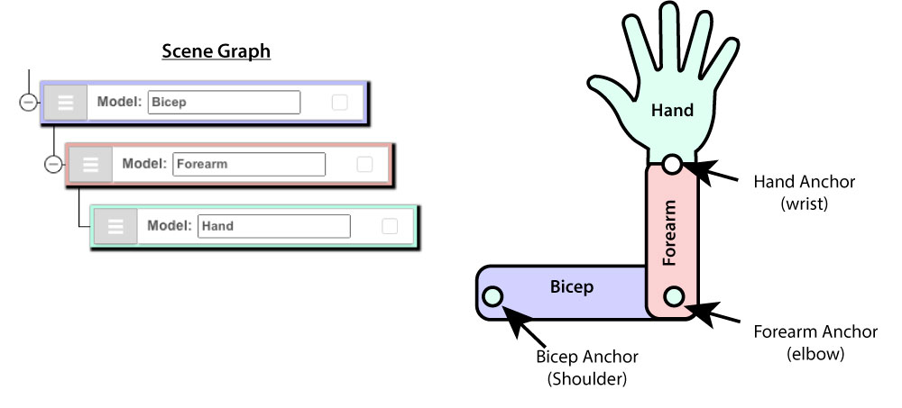
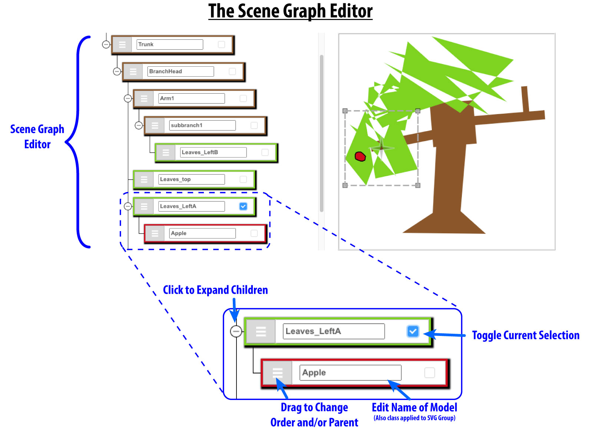

# CS 4620 Assignment 2

In Assignment 1 you implemented controllers for manipulating a single object in a 2D drawing.  In this assignment, we will take it up a notch by extending our drawing application to support hierarchical 2D models. These hierarchical models will become the basis for 2D animations later on.

The idea of transformation hierarchies is to factor objects and scenes into parts and subparts where that can all be edited and moved in an organized way. 
In principle, extending the models we used in A1 to support hierarchies is straightforward&mdash;in fact, the `AModel` base class already supports basic child-parent relationships. However, to give these relationships meaning, we need to ensure that each node inherits the effects of transformations applied to its ancestors. This brings us to the core of Assignment 2, which has two parts:
 - First, we will extend the model class we built in Assignment 1 to handle transformations in a hierarchical manner.
 - Second, we will extend the tools we offer users to make manipulating transformation hierarchies (i.e., a scene graph) easier. This will involve writing new controllers and support for simple scene graph operations.

 
## Background

As you know from the hierarchy lectures (maybe review those now...), transformation hierarchies offer a powerful way define spatial relationships between related objects and their parts. For example, if we place various objects on a table, we can expect those objects to move when the table moves. In a graphics system, we can represent this dependency by making each object a child of the table's node in our scene graph.
 
Transformation hierarchies play an even more critical role when it comes to animating articulated objects&mdash;for example, the joints of a human body or mechanical device. Take the human arm, which we can approximate as a hierarchy of bones and joints. Intuitively, the location of a person's hand and fingers will change if they bend their elbow. However, the reverse dependency does not typically apply: one can easily bend their wrist without moving their elbow or bicep. We can code these asymmetric dependencies in a transformation hierarchy, represented as a directed graph.
 
So here's a question: if our hierarchical representation of the arm makes the hand a child of the forearm, and the forearm the child of the bicep, then how are the wrist and elbow defined? Are they represented explicitly, or merely implied by the structure of our graph? It's tempting to say that joints correspond to the edges of our graph, but that's not the whole story. A joint is a geometric concept; it has a particular location in space&mdash;typically, the origin of whatever transformation that joint permits. The elbow, for example, is the origin of rotations that the forearm is permitted to make around the bicep.  We call this point the ***anchor*** of the forearm. Note that this need not be the origin of our forearm's object coordinates&mdash;the `A` in our `PRSA` representation of matrices stands for "Anchor Shift", which represents translation between the anchor and the object's origin. 
 
  
 

<!---
In Section this week, we showed you the `thdemo` (transformation hierarchy demo), which
 
a transformation hierarchy, we need these to relathere are some interesting design decisions in how to use this hierarchy, and the hierarchy has implications that make the design of user interactions a lot more interesting.
-->

## Specifications

In this assignment, you’ll start with an editor that looks fairly similar to what we used in assignment 1.  The user can create models in the same way as in A1, and can manipulate them using controllers like the ones in A1 that allow moving the position or anchor point of an model, scaling the object by dragging selection box handles, and rotating with a slider control.  Models are initially children of the root model.

One additional feature of the starter code is a scene graph editor that appears to the left of the drawing area, which provides a list of the objects in the scene and allows for renaming and reordering them (controlling which appears in front of which in the drawing).

In this assignment we ask you to add additional functionality for editing the scene graph:

- The user can rearrange the structure of the scene graph by dragging and dropping nodes in the graph editor to change which node is the parent of the dragged node.
- The user can use the *GroupChildren* command to create a new group that contains the children of the selected node.  This means creating an empty group node, moving all children of the selected node to become children of the group, and making the group a child of the selected node. The anchor of this newly created node is in the center of its bounding box.
- The user can select a node with children and use the *UngroupChildren* command to turn those children into siblings of the selected node. If UngroupChildren is used on a group node then that node is deleted once its children have been moved.

In all these scene graph operations, your code should follow the Golden Rule:

> When you edit the scene graph, the scene does not change.

This means that before and after the scene graph edit (a reparenting, grouping, or ungrouping operation), the object-to-world matrices of all objects should remain unchanged.

There is one exception to the Golden Rule, though.  The rule implies a particular matrix for an object whose parent changes, and it's possible that that matrix cannot be represented as a product of rotation, scale, and translation.  In particular, this happens when you have nonuniform scales above rotations in the hierarchy, which can cause the first two columns of the matrix not to be orthogonal vectors.  In that case it is fine to let updateMatrixProperties do its thing, and the matrix will change.

Furthermore, we also ask you to improve the functionality of the controller that lets the user manipulate the transformations of objets:

- When models (whether objects or groups) are selected, the user can manipulate them using the same selection-box controls as in the starter code.  In all cases, the user sees a bounding box surrounding the shapes being manipulated, and manipulating the selection box handles and the anchor results in changes to the transformation of the selected model that are consistent with the user input.

## Software

As with Assignment 1, you will implement this assignment as a web application using the `AniGraph` library.  The starter code is in [this repository](https://github.coecis.cornell.edu/CS4620-F2020/assignment2).  You'll recall that `AniGraph` is a Model-View-Controller system, meaning that any interactive element on the screen is produced by a model, which keeps track of its state; a related view, which manages the on-screen representation of the model; and a controller, which manages the relationship between them, in particular being responsible for how user input on the view causes changes to the model.

 
In A2, you'll find the application, which is renderd by the code in `index.jsx` consists of three top-level components: 
* an `A2ToolPanel`, which has all the familiar GUI controls from A1;
* an `ASceneGraphEditor` which displays the hierarchy and lets the user manipulate it; and
* an `A2GraphicsComponent` which is responsible for displaying the model.
You don't actually have to do anything with the code for these components.

In the code for `A2GraphicsComponent` the component sets itself up to use the model `A2Model`, the view `AView2D`, and the controller `A2DShapeController`.  This controller is a standard AniGraph controller that lets you supply "interactions" that define the start, move, and end callbacks for a particular mode of interaction; the provided A1-style interactions are defined in `ReferenceA1InteractionImplementations.js` and your new ones are in `SceneGraphElementInteractions.js`. The work of this assignment is all in the model and the interactions.

### Model

The model is really the central class in this assignment.  It's worth studying carefully the code in `A2Model` and its superclasses, (it's not much code, really) because understanding how it works will be important for figuring out how to correctly carry out the tree operations that enable grouping and reparenting.

An important thing to realize about the design of this application is that (as in most scene graphs) the `AModel` class (really, its superclass `AObjectNode`) supports all nodes having a parent and children, and the `AModel2D` class supports all nodes containing shapes (represented as lists of vertices).  But these classes only keep track of individual node transformations and parent/child relationships; they don't know anything about transformation hierarchies.  Also, grouping involves creating empty scene graph nodes: group nodes have children but contain no geometry.  So in A2 we have two new subclasses for these two concepts.  `A2Model` is a subclass of `AModel2D` that overrides a number of methods to provide hierarchical transformations (in which a node's transformation applies to all its descendants); and `A2ModelGroup` is a subclass of `A2Model` that disallows adding geometry, to be used for group nodes.

The operations provided by the model class for operating on the tree are pretty standard. The key tools are the methods of `AObjectNode`: `getParent`, `getChildren`, and `mapOverChildren` for traversing the hierarchy and `setParent`, `addChild`, and `removeChild` for editing it.  

The key things the model classes do are:

* override the various `get...Matrix` methods, `getVertices`, `get/setPosition`, and `getWorldSpaceBBoxCorners` so that they account for the transformations of their ancestor nodes.  Most of these are provided, but you need to implement `getObjectToWorldMatrix` and `get/setPosition`; you should study the provided implementations to understand how the tree operates.
* override `removeFromParent` and `attachToNewParent` so that transformations are managed correctly when moving from one parent to another.  You need to implement these.
* provide the callbacks `groupChildren` and `ungroupChildren`, which are called by the UI and are implemented in terms of `removeFromParent` and `attachToNewParent`.
* provide a new method `getChildTreeObjectSpaceBoundingBox` that generalizes the notion of "object space corners" to return a box that encloses all the children.

What you implement in A2Model includes three kinds of functions:

* Functions that deal with transformations between object and world space:
  - The override `getObjectToWorldMatrix` that replaces the original version that just returns the object's matrix (which now is only a transformation from a node's object space to its parent's object space).
  - The overrides `getWorldPosition` and `getWorldPosition` that replace the superclass versions that simply get and set the `position` property.
* Functions that deal with bounding boxes:
  - The method `getChildTreeObjectSpaceBoundingBox`, which initially just returns the `objectSpaceCorners` array that you'll remember from A1.  For a node without children this is correct, but for a node with children, the bounding box needs to be enlarged to also bound the children.  It's easiest to do this by making the box bound the _bounding boxes_ of the children, which you can get with a recursive call.
  - The method `recenterAnchorInSubtree` which is used to compute a convenient initial location for the anchor in a newly created group.
* Functions for editing the scene graph:
  - `removeFromParent`, which clears the parent of an object and updates its transformation to the transformation that would be correct if the parent was the root.
  - `attachToNewParent`, which sets the parent of a parent-less node and updates its transformation so that the object remains in the same location.

More details and implementation hints can be found in the comments in the source file.

Once your graph editing opertaions work, you will be able to parent an object to another one using the scene graph editor.  If you see afterwards that the object is indeed a child of the correct node, and it has not moved on the screen, you've won.  (Remember that if there are nonuniform scales inside the hierarchy (i.e. at nodes other than leaf nodes) it is OK for the object to move when it is not possible to keep it in place.)

Also, once parenting works, grouping and ungrouping should also work, since those operations are already implemented in terms of parenting operations.

### Interactions

The controller we are using delegates the handling of interaction to `Interaction` classes, and when you select the A2Controller interaction mode in the GUI, the `Interaction`s in  `SceneGraphElementInteractions.js` are active.  There are three of them, and their basic form is familiar from A1, though the details are a little different:

* `DragToScaleAroundWorldPointInteraction` is the drag interaction responsible for mouse input on the bounding box selection handles.  It works very much like the A1 version, with `dragStart`, `dragMove`, and `dragEnd` callbacks.  You should model your implementation on the provided reference implementation of the A1 behavior (in `ReferenceA1InteractionImplementations.js`), but it needs to still work when you select objects that have parents with any kind of transformation.

* `AIDragToMovePosition` and `AIDragToMoveAnchorPoint` are the interactions responsible for moving objects (changing their positions) and moving anchor points.  Again study the A1 reference implementations first, then construct a version that works underneath parent transformations.  The implementations of these classes can be very short.

## Creative portion

There are two ways to go with the creative portion.  One is to use your completed tool to build an articulated character.  It should be at least as complex as a simple humanoid figure with joints at the shoulders/hips, elbows/knees, wrists/ankles, and neck.  But it doesn’t have to be humanoid.  Cats? Dogs?  These have similar skeletal structure but rather different proportions.  Birds? Fish? Cephalopods? These might need different sets of joints.  Weird robots and monsters?  Who knows.  Show us your character or creature in a few different poses.

Alternatively you can add a new manipulation feature to the program.  Maybe you can control rotations with a more direct interface than the slider?  Maybe you don’t like the scaling interface with bounding boxes (though you still need to support those for the specified part) and want to provide an alternative scaling mode.  Maybe you’d like to make an interface that works nicely on a touchscreen device and uses multi-touch gestures to control transformations in a really intuitive way.  There is a lot of running room here once you have a controller attached to a model.

In addition to including the implementation in your zip file handin, you’ll turn in either a 1-minute video with a demo and explanation, or a 2-page report with screenshots and explanation.
