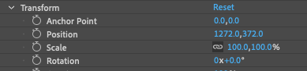
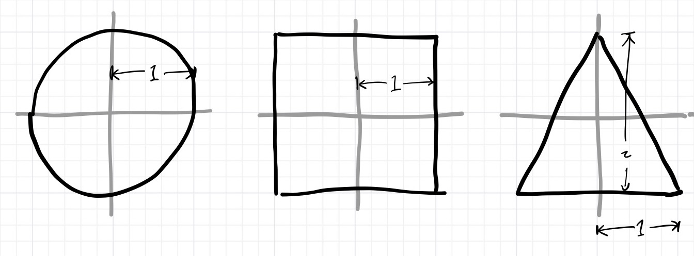
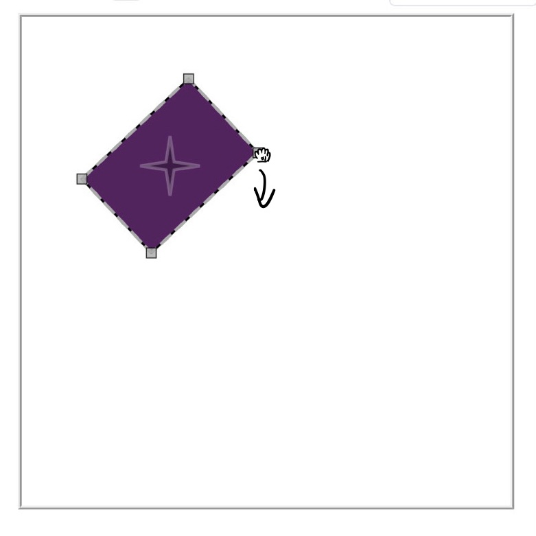
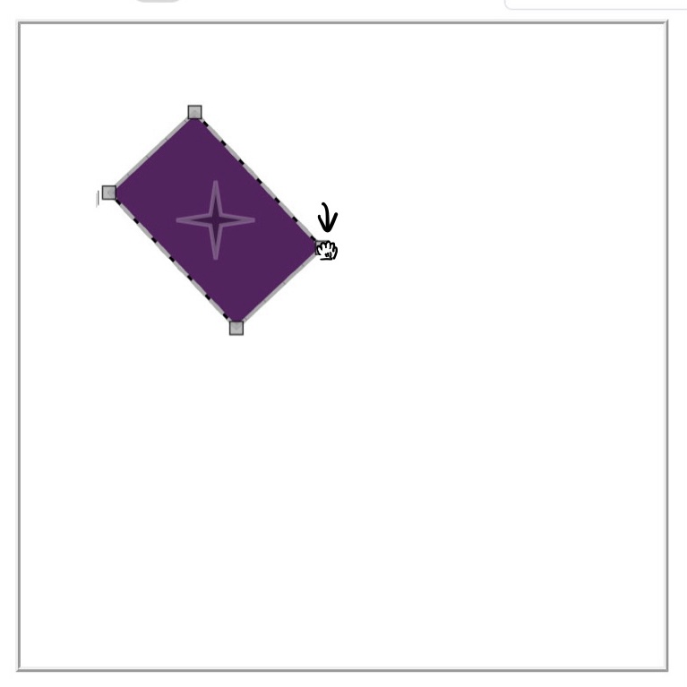

# Assignment 2 study problems

This is a set of problems to be worked on in your study group.  You do not have to turn anything in, but you should attempt them and discuss them, and work through them carefully if you sense you are confused about the goals of any of the code you are writing for this assignment.  Also please think about and attempt these problems before seeking 1:1 office hours help with the concepts in this assignment.

A quick heads-up: 

- The new matrix factorization is M = PRSA (position, rotation, scale, anchor) instead of M = ORST as we had in A1. 
- P stands for position, R for rotation, S for scale and A for anchor shift.
- Anchor shift is described by the T in A1, but by A in A2. 
- Anchor point = - Anchor shift. 

Below is an image of Adobe naming convention. Note the difference between anchor point and anchor shift.

## Problem 1: Hierarchy operations

Suppose I have the following tree, containing three shapes with the given matrix properties for each:

~~~
root (identity matrix)
 |
 + circle  p=(1,2) r=90 s=(1,1) a=(-1,0)
 |
 + triangle p=(0,0) r=180 s=(1,2) a=(0,-1)
    |
    + square p=(0,1) r=0 s=(1, 1/2) a=(0,0)
~~~

(In this diagram circle and triangle are children of the root, and square is a child of triangle.  The letters p, r, s, and a stand for position, rotation, scale, and anchor shift.)

These objects in their local coordinates have the dimensions shown here:

(a) Sketch these four shapes in world coordinates on some graph paper.  Mark the anchor points of the four shapes.

(b) What is the matrix of the square (i.e. it's object-to-parent matrix)?  What is the object-to-world matrix of the square?
Hint: You will want to write out the matrices for each object according to its properties.

### 1.1: reparenting

Now suppose the square is reparented to the circle.  

(a) Draw the tree afterwards.

(b) Sketch the four shapes afterwards (just kidding; the picture does not change). 

(c) What is the matrix of the circle afterwards?  What are the four matrix properties?  Compute the object-to-world matrix to verify that it is the same as it was before.

(d) What is the location of the square's anchor in its own object space?  What is the position of the square's anchor in it's parent's space?  Compute the anchor position in world space and verify it is the same as before.

### 1.2: grouping and ungrouping

Suppose you take the tree above (in its original form), select the triangle, and say "group children."  

(a) Draw the tree after this operation.  (No need to sketch the picture -- remember it doesn't change!)

(b) What are the transformations of the group and its children after the operation?  What are their matrix properties?

Now suppose we scale the group by (2,1).

(c) If we select the triangle and say "ungroup children," what will the resulting matrix and matrix properties be for the square?  Confirm it still multiplies to the same object-to-world transformation.

(d) If we instead first rotate the square by 45 degrees, then say "ungroup children," what will the resulting matrix be for the square?  (Verify the object-to-world transformation is the same.)  What will its matrix properties be?  (Verify they multiply back to the matrix you just computed.)  Is there a problem here?

## Problem 2: Bounding boxes

Try to work on this problem on paper first and then test it with the program after you have completed the assignment. This problem meant to provide an intuition for computing bounding box of rotated objects. 

Consider this tree containing four squares, assuming p is the center of the shape, r is rotation degree, s is scale and a is anchor shift:

~~~
root (identity matrix)
 |
 + A square p=(0,0) r=0 s=(1,1) a=(0,0) (identity)
   |
   + B square p=(0,5) r=0 s=(1,1) a=(0,0) (translated identity) 
     |
     + C square p=(4,3) r=0 s=(2,2) a=(0,0) (translated identity, scaled up by 2)
     |
     + D square p=(5,2) r=45 s=(1,1) a=(0,0) (translated identity, rotated 45 degrees)

~~~

(a) What is the bounding box of the subtree rooted at B, in the object space of node B?  In the object space of node A?  In world space?

(b) How does this box change if I apply a translation to B?

(c) How does this box change if I apply a translation to D in the +x direction?  What about in the -x direction?  (Note that we are only asking you to translate D by a limited distance and see whether you can keep the bounding box size unchanged. Is it possible at all in one of the directions?)

(d) Suppose I apply a 45 degree rotation to node A.  Then what are the answers to (a)?  How does this answer differ from the one your program will compute (by the method of making boxes that bound the bounding boxes of the children, rather than exactly bounding the geometry)?

## Problem 3: Controllers

Consider this scene:

<!-- ~~~
 [screen shot of UI with one selected shape,
showing a bbox at an 45 degree angle with handles.
click-and-drag shown as two points with an arrow,
moving one handle so as to make the wide side of
the bbox narrower and the narrow side wider.] 

~~~ -->

From the first picture and the assumption that the object is 1 by 1 unit in its object coordinates, we can estimate the object-to-world transformation of the shape is position=(150,150), rotation=45, scale=(100,150), anchorshift=(0,0). 

(a) Suppose the user clicks and drags as shown such that the wider side of the rectangle gets narrower and the narrower side of the rectangle gets wider (note that this is a scaling instead of a rotation). Approximately what might be the new scale factors?  Also think about how the bounding box changes (Just worry about whether they are larger or smaller than the old ones and you don't have to overthink it.)

(b) This interaction will work just great with the A1 controller, if this shape is directly a child of the root.  What numbers will it be computing the ratios of to get the scale factors it applies?

But what if the shape is actually in a group, with the transformations:

* group:  position=(150,150), rotation=45, scale=(1,1), anchorshift=(0,0)
* object: position=(0,0), rotation=0, scale=(100,150), anchorshift=(0,0)

Verify this produces the same object-to-world transformation given above via matrix multiplication.

(c) What will the A1 drag controller do with the mouse movement in the figure, if it is the shape rather than the group that is selected?  What ratios and scale factors will it compute?

(d) What transformation can be applied to the cursor positions to arrive at the same scale factors as in part (a), so that the controller works correctly again? Can you work out the matrix for that transformation?
